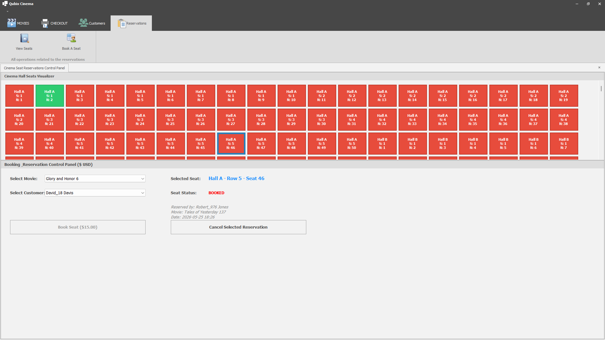
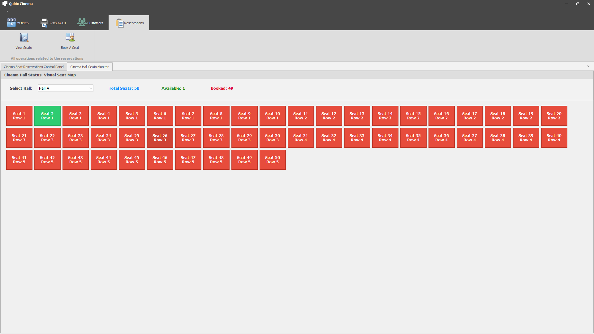
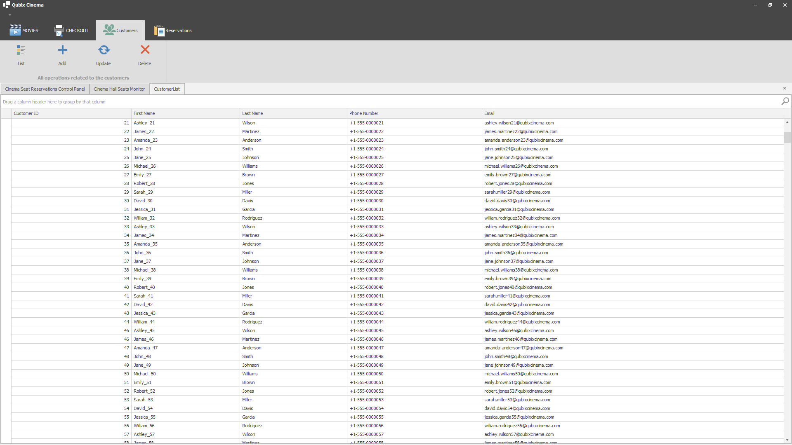
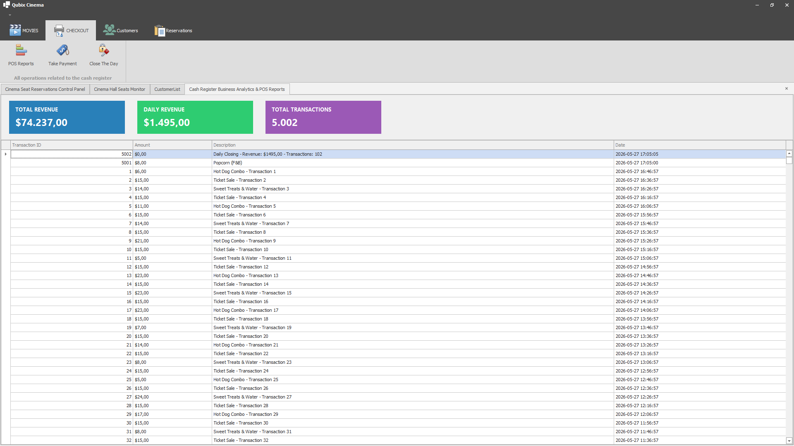
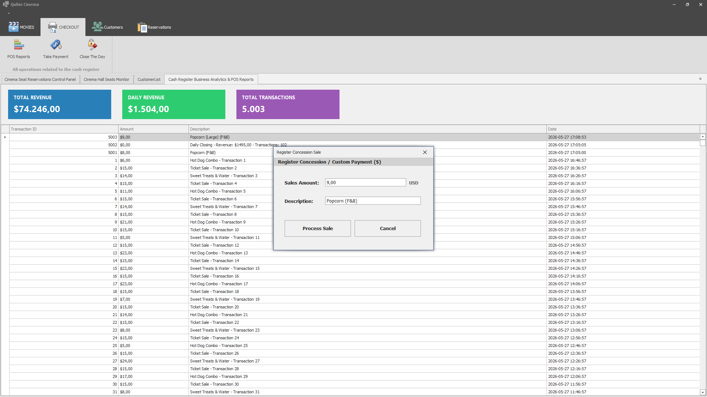
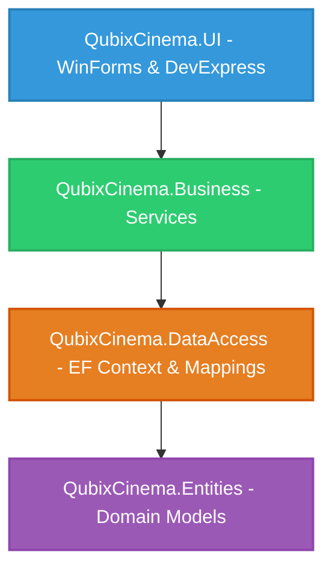

# 🎬 QubixCinema - Enterprise Cinema Reservation & POS Management System

**QubixCinema** is an enterprise-grade, N-tier desktop application built for managing movie theaters, customer profiles, dynamic seat bookings, and concession cashier (POS) transactions. It is developed using **C# .NET Framework 4.7.2**, **Entity Framework 6 (EF6) Code-First**, and the premium **DevExpress WinForms v25.2** suite.

---

## 📸 Screenshots Gallery

Here are the visual interfaces of the fully-featured cinema reservation and POS dashboard in action:

<p align="center">
  
  <br/>
  <b>Figure 1:</b> <i>Main MDI Dashboard & Office-Style DevExpress Ribbon Navigation</i>
</p>

<p align="center">
  
  <br/>
  <b>Figure 2:</b> <i>Optimized Hall-Based Seat Visualizer with Real-Time KPI Statistics</i>
</p>

<p align="center">
  
  <br/>
  <b>Figure 3:</b> <i>Dynamic Reservations Visualizer & Reservation Booking Panel ($ USD)</i>
</p>

<p align="center">
  
  <br/>
  <b>Figure 4:</b> <i>Cash Register POS Analytics Dashboard with KPI Cards & GridControl</i>
</p>

<p align="center">
  
  <br/>
  <b>Figure 5:</b> <i>Concession / Snack Payment Dialog & Day Closing Logs</i>
</p>

---

## 🏛️ System Architecture

The application is structured following the **N-Tier (Layered) Architecture** pattern to enforce separation of concerns, high maintainability, and clean testability:



### 1. Presentation Layer (`QubixCinema.UI`)
- **Main Interface (`Form1`):** Features a modern Office-style DevExpress Ribbon control with clean categories and navigation.
- **Tabbed MDI Manager (`xtraTabbedMdiManager`):** Manages child forms as premium tabbed pages at the top of the interface.
- **Forms Catalog:** House specialized views for CRUD actions (Movie, Customer) and checkout controls (POS Reports, Concession Payments).

### 2. Business Logic Layer (`QubixCinema.Business`)
- Encapsulates domain logic using the **Services Pattern**:
  - `MovieService.cs` & `CustomerService.cs`: Manages records persistence and queries.
  - `ReservationService.cs`: Coordinates dynamic booking transactions. When a ticket is reserved, it books the seat and automatically logs a **+$15.00 USD** entry in the cash register. When cancelled, it frees the seat and posts a **-$15.00 USD** refund entry.
  - `RegisterService.cs`: Aggregates transactions, calculates daily/total revenues, and manages the "Close Day" closing ledger log.

### 3. Data Access Layer (`QubixCinema.DataAccess`)
- Uses **Entity Framework 6** with Fluent API mapping files:
  - `QubixCinemaContext.cs`: Maps database tables and loads mappings.
  - **Mappings:** `MovieMap`, `CustomerMap`, `SeatMap`, `ReservationMap`, `RegisterMap` (specifies data-types, lengths, and constraints like `money` and `datetime`).
  - `DatabaseSeeder.cs`: Seeds default hall seat maps automatically upon first loading.

### 4. Core Entities Layer (`QubixCinema.Entities`)
- Contains lightweight POCO domain models: `Movie`, `Customer`, `Seat`, `Reservation`, and `Register` (representing the POS ledger).

---

## 🌟 Key Features

### 🎞️ Movie & Customer CRUD Management
- Comprehensive panels to add, edit, list, and delete profiles.
- Standard forms upgraded to beautiful **`DevExpress.XtraEditors.GroupControl`** containers with unified borders and typography.
- Standard grid views replaced with **`DevExpress.XtraGrid.GridControl`** & **`GridView`** with automatic column best-fit, search, and dynamic sorting.

### 🛋️ Optimized Seat Viewer (`Seats.cs`)
- **Hall-Based Filtering:** Solves bottleneck lag by letting users select specific Halls (`Hall A` to `Hall T`) from a dropdown. It only loads and draws the 50 seats belonging to the active Hall.
- **Real-Time KPI Cards:** Displays forest green (Available), crimson red (Booked), and total seat counters dynamically.
- **Detailed Tooltips:** Clicking any seat triggers a detailed modal showing row, number, and booking status.

### 🎟️ Booking Control Panel (`Reservations.cs`)
- Fully-featured booking visualizer:
  - **Available Seats (Green):** Click to select a movie, select a customer, and book standard seats for a fixed **$15.00 USD**.
  - **Booked Seats (Red):** Click to view active reservation metadata (reserved customer name, movie title, and timestamp) with a one-click button to cancel and process a refund.

### 💳 POS Cashier & Analytics Dashboard (`RegisterReportsForm.cs`)
- Displays cash register transactions formatted in USD ($).
- **KPI Flat Cards:** Real-time summary boxes indicating **Total Revenue ($)**, **Daily Revenue ($)**, and **Total Transactions Count**.
- **Concessions Logging (`TakePaymentForm.cs`):** Simple popup dialog to post custom food, beverage, and retail sales (e.g. Popcorn, Soda combo specials).
- **End-of-Day Kapatma (Close Day):** Summarizes daily cash register transactions and writes a summary ledger entry.

---

## 💾 Real-World English Database Seeder (`SeedData_EN.sql`)

The project contains a comprehensive SQL script: [SeedData_EN.sql](file:///c:/Users/Kaaner4mir/source/repository/QubixCinema/SeedData_EN.sql). Running it creates a realistic local testing environment containing:
- **200 Movies:** Realistic blockbuster titles ("Inception", "The Dark Knight", "Interstellar"), sequels, and IMAX versions with real runtimes and genres.
- **1,000 Customers:** Natural English names ("John Smith", "Emma Johnson", "William Moore"), phone numbers, and unique email formats.
- **1,000 Seats:** Distributed across 20 distinct cinema halls (`Hall A` to `Hall T`).
- **5,000 Reservations:** Realistic historical bookings over the past several months.
- **5,000 Cash Register Transactions:** Real-world concession items ("Popcorn & Coca-Cola Combo", "Nachos with Warm Cheese Dip") and ticket sales.

---

## 🛠️ Technologies Used

- **Language:** C# 7.3
- **Framework:** Microsoft .NET Framework 4.7.2
- **UI Components:** DevExpress WinForms v25.2
- **ORM:** Entity Framework 6.5.2 (Code-First)
- **Database:** Microsoft SQL Server (LocalDB / SQLExpress)
- **Development Tool:** Visual Studio 2022/2026

---

## 🚀 Getting Started

### 1. Connection String Configuration
Open `QubixCinema/App.config` and configure your SQL Server instance in `<connectionStrings>`:

```xml
<connectionStrings>
  <add name="QubixCinemaEFContext" 
       connectionString="Data Source=YOUR_SERVER_NAME; Initial Catalog=QubixCinemaDB; Integrated Security=true" 
       providerName="System.Data.SqlClient" />
</connectionStrings>
```

### 2. Database Seeding
Open your favorite SQL Server utility (e.g. SSMS or Azure Data Studio), connect to your server, and run the SQL query from the [SeedData_EN.sql](file:///c:/Users/Kaaner4mir/source/repository/QubixCinema/SeedData_EN.sql) file. This will automatically set up the `QubixCinemaDB` database and populate all tables with realistic mock records.

### 3. Compilation & Execution
Open the `qubix-cinema` solution file in Visual Studio, select **Debug** configuration, build the project, and hit **F5** to run the otomasyon program.

---

## 📄 License

This project is licensed under the **MIT License** - see the [LICENSE](LICENSE) file for details.
